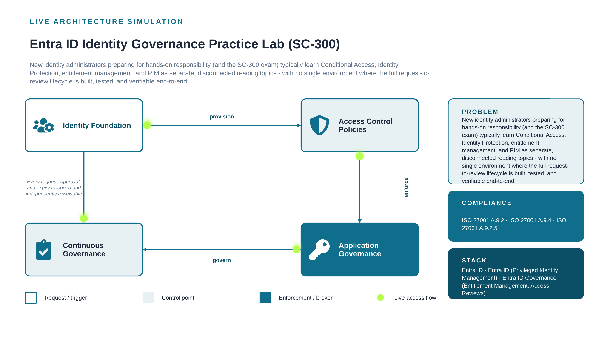

# Entra ID Identity Governance Practice Lab (SC-300)

**Classification:** Internal Use - Certification Practice Lab
**Owner:** IAM Engineering (Self-Directed Certification Practice)
**Document Status:** Approved
**Last Reviewed:** 2026-08-22
**Review Cadence:** Revisit after each SC-300 attempt, or upon material Entra ID feature change

---

## 1. Purpose

This is a certification practice lab, not a client engagement or employer environment record. It exists to close the gap between passing the Microsoft SC-300 (Identity and Access Administrator) exam and being operationally ready to configure the same controls in a live tenant. New identity administrators preparing for hands-on responsibility (and the SC-300 exam) typically learn Conditional Access, Identity Protection, entitlement management, and PIM as separate, disconnected reading topics - with no single environment where the full request-to-review lifecycle is built, tested, and verifiable end-to-end.

## 2. Scope

This lab covers all four SC-300 exam domains, built and tested in a single connected Entra ID tenant (Microsoft 365 Developer Program sandbox with Entra ID P2 / Entra Suite trial licensing). It does not cover Microsoft Defender or Microsoft Intune content — those map to separate certifications (SC-200 and MD-102 respectively) and are intentionally out of scope for this lab.

**In-scope platform:** Entra ID, Entra ID (Privileged Identity Management), Entra ID Governance (Entitlement Management, Access Reviews)

## 3. Risk Statement

**Gap addressed:** Exam-only preparation without hands-on configuration risks a gap between passing a certification and being operationally ready to administer these controls in a live tenant - particularly for judgment-heavy areas like Conditional Access exclusions, risk policy thresholds, and access review auto-apply settings.

**Residual gap after completing this lab:** Low. All four SC-300 governance domains have been configured, tested, and evidenced hands-on in a live (trial-licensed) tenant, not simulated. Residual gap is limited to scale-specific operational experience (e.g., managing thousands of users) that a personal lab cannot replicate.

## 4. Architecture



Full build rationale and alternatives considered are documented in [`architecture/decision-record.md`](architecture/decision-record.md).

*Diagram legend: white/outlined node is the identity foundation (users, groups); tinted nodes are policy/control checkpoints; the solid-filled node is where application-level enforcement lives. The dashed loop represents the audit trail every request, approval, and expiry leaves behind.*

## 5. SC-300 Exam Domain Coverage

| SC-300 Domain | What This Lab Builds |
|---|---|
| Implement identities and access | Dynamic groups, attribute-based membership, user lifecycle (Part 1) |
| Implement authentication and access management | Conditional Access baseline policies, Identity Protection risk policies (Parts 2-3) |
| Implement access management for apps | App registration, app roles, delegated permissions, admin consent (Part 4) |
| Plan and implement identity governance | Entitlement management access packages, access reviews, PIM for Groups (Parts 5-7) |

## 6. Underlying Compliance Mapping

The features built here aren't exam-only abstractions — they're real controls. See [`compliance/compliance-mapping.md`](compliance/compliance-mapping.md) for the ISO 27001 mapping and control testing procedure.

| Requirement | Description |
|---|---|
| ISO 27001 A.9.2 | User access provisioning and de-provisioning |
| ISO 27001 A.9.4 | System and application access control |
| ISO 27001 A.9.2.5 | Review of user access rights |

## 7. Governing Policy

Formal governance statements for this lab (the same discipline applied to the rest of this portfolio) are documented in [`policies/access-control-policy.md`](policies/access-control-policy.md).

## 8. Evidence & Screenshots

[`screenshots/SCREENSHOTS_NEEDED.md`](screenshots/SCREENSHOTS_NEEDED.md) defines exactly what to capture from each of the seven build parts — useful both as portfolio evidence and as your own study review material later.

## 9. Directory Structure

```
sc300-entra-practice-lab/
├── README.md
├── architecture/
│   ├── architecture.png
│   └── decision-record.md
├── compliance/
│   └── compliance-mapping.md
├── policies/
│   └── access-control-policy.md
├── screenshots/
│   └── SCREENSHOTS_NEEDED.md
└── .gitattributes
```

## 10. Lessons Learned

Building PIM for Groups after already having built PIM for directory roles made the distinction between the two immediately obvious in a way reading about them separately never did - group-based PIM is the one most self-study guides under-cover, and the one most likely to show up as an unfamiliar scenario on the exam.

## 11. Related Work

This lab is separate from, but complements, the 12-project hybrid IAM portfolio built on Okta, Entra ID, and Jira Cloud. Where the portfolio demonstrates solving specific real-world risks end-to-end, this lab demonstrates breadth across Entra ID's identity governance surface specifically, mapped directly to certification content.

---

[⬅ Back to portfolio index](../README.md)
